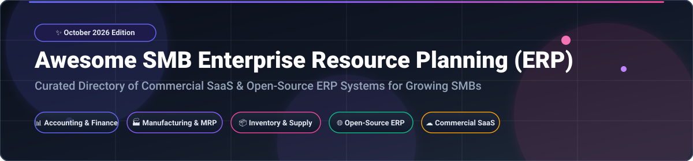

# Awesome SMB Enterprise Resource Planning (ERP) 💼🚀

  
  
  
  

  

> **A Curated Directory of Commercial SaaS Products & Open-Source GitHub ERP Projects**  
> *Focused on Modular Business Management, Financial Accounting, Inventory Control, MRP Manufacturing & SMB Operations.*

📅 **Last updated: October 2026**

---

This repository tracks notable **commercial ERP platforms** and **open-source software projects** specifically designed for small and medium-sized businesses (SMBs). These integrated business platforms manage accounting, inventory, CRM, procurement, supply chain, manufacturing, and HR — replacing disconnected spreadsheets and fragmented point solutions with end-to-end business automation.

---

## 📌 Table of Contents

- [☁️ SaaS / Hosted ERP Platforms](#️-saas--hosted-erp-platforms)
  - [📊 Market Overview & Industry Dynamics](#-market-overview--industry-dynamics)
  - [🏢 Commercial ERP Comparison Table](#-commercial-erp-comparison-table)
- [🌐 Open-Source GitHub Projects](#-open-source-github-projects)
  - [⭐ Open-Source ERP Repositories (Sorted by Stars)](#-open-source-repositories-sorted-by-stars)
  - [🛠️ Architecture & Deployment Considerations](#️-architecture--deployment-considerations)
- [🤝 How to Contribute](#-how-to-contribute)
- [⚠️ Disclaimer](#️-disclaimer)
- [⭐ Star History](#-star-history)
- [💖 Support & Community](#-support--community)

---

## ☁️ SaaS / Hosted ERP Platforms

### 📊 Market Overview & Industry Dynamics

> 💡 **Market Size & Structure**:  
> The global Small & Medium Business (SMB) ERP market is estimated at **~$65 Billion in 2026** and is projected to reach **~$110 Billion by 2030** (CAGR ~8.8%).  
> The sector is **moderately to highly fragmented** — there is no single "winner-take-all" dominant player because SMB ERP requirements vary drastically by industry vertical (e.g., job-shop manufacturing vs. wholesale distribution vs. retail e-commerce) and local tax/compliance regulations (GoBD, DATEV, GST, MTD). Enterprise giants (Microsoft, SAP, Oracle NetSuite) lead in multi-entity mid-market deployments, while nimble cloud-native platforms (Odoo, Acumatica, Katana) capture high-growth SMB segments.

---

### 🏢 Commercial ERP Comparison Table

*Sorted by **Company Size / Market Cap / Valuation** (Descending)* 📉

| Product / SaaS Platform | Company Size / Valuation / Revenue | Specific Starting Price | Free Tier / Free Trial Limits | Key Strengths & Best Use Cases |
| :--- | :--- | :--- | :--- | :--- |
| **[Microsoft Dynamics 365 Business Central](https://dynamics.microsoft.com/en-us/business-central/overview/)** 🏢 | **~$3.1 Trillion Market Cap** *(Microsoft Corp / $245B+ Rev)* | **$70 / user / month** *(Essentials tier)* | **30-day free sandbox trial** *(Full evaluation environment)* | Deep Microsoft 365, Power BI, & Power Platform integration. Best for companies on Microsoft stack. |
| **[Oracle NetSuite](https://www.netsuite.com/portal/home.shtml)** 🌐 | **~$480 Billion Market Cap** *(Oracle Corp / $53B+ Rev)* | **$999 / month base + $99 / user / month** | **No free trial** *(Guided product tour & sandbox demo on request)* | Pure cloud-native multi-subsidiary ERP with global consolidation, CRM, and e-commerce. |
| **[SAP Business One](https://www.sap.com/products/erp/business-one.html)** ⚙️ | **~$260 Billion Market Cap** *(SAP SE / $35B+ Rev)* | **$108 / user / month** *(Cloud starter subscription)* | **30-day free cloud trial** *(Partner-hosted test drive)* | Financials, CRM, and production. Proven entry point to SAP ecosystem for mid-market SMBs. |
| **[Sage 300](https://www.sage.com/en-us/products/sage-300/)** 📈 | **~$14 Billion Market Cap** *(Sage Group plc / $2.8B Rev)* | **$120 / user / month** *(Core subscription tier)* | **30-day free product trial** *(On-demand online evaluation)* | Strong distribution and manufacturing operational workflows with multi-currency finance. |
| **[Odoo Enterprise](https://www.odoo.com/)** 🚀 | **~$5.3 Billion Valuation** *(€400M+ ARR / Bain & Sequoia)* | **€11.90 ($13.50) / user / month** *(Standard plan)* | **Free forever for 1 app** *(Odoo One App Free); 15-day trial for multi-app* | 80+ official apps & 50,000+ community modules. Studio no-code customizer & automated accounting. |
| **[Epicor Prophet 21](https://www.epicor.com/en-us/products/prophet-21/)** 📦 | **~$5.1 Billion Valuation** *($1B+ Rev / KKR backed)* | **$150 / user / month** *(Distribution suite base tier)* | **No public free trial** *(Guided interactive video tour & custom sandbox)* | Purpose-built ERP for wholesale distributors with order management and inventory optimization. |
| **[Acumatica](https://www.acumatica.com/)** ⚡ | **~$2.5 Billion Valuation** *($150M+ ARR / EQT backed)* | **$1,000 / month base** *(Consumption-based / unlimited users)* | **30-day free sandbox trial** *(Acumatica Cloud test drive)* | Unlimited user pricing model based on transaction volume. Financials, distribution, & project management. |
| **[Zoho One](https://www.zoho.com/one/)** 💼 | **~$1.2B+ Annual Revenue** *($5B+ Est. Valuation / Bootstrapped)*| **$37 / employee / month** *(All-employee pricing option)* | **30-day full-featured free trial** *(No credit card required)* | 45+ integrated SaaS apps (Books, Inventory, CRM, Desk, People) for small businesses. |
| **[Katana Cloud Manufacturing](https://katanamrp.com/)** 🏭 | **~$100M+ Valuation** *($35M+ Raised / Scale VP backed)*| **$99 / month** *(Essential tier / small shop)* | **14-day full feature free trial** *(No credit card required)* | Visual shop-floor control, real-time master inventory, and manufacturing order scheduling. |
| **[SYSPRO](https://www.syspro.com/)** 🛠️ | **~$100M+ Annual Revenue** *(Advent International backed)* | **$195 / user / month** *(Manufacturing / Distribution base)* | **No public free trial** *(Virtual interactive demo & proof-of-concept)* | Deep shop floor control, lot/serial traceability, advanced material requirements planning (MRP). |

---

## 🌐 Open-Source GitHub Projects

Open-source ERP systems are among the most active and valuable open-source communities. They provide complete code transparency, self-hosting privacy, and zero licensing fees for small businesses with technical expertise.

---

### ⭐ Open-Source Repositories (Sorted by Stars)

*Sorted by **GitHub Stars_Count** (Descending)* 🌟

1. **[Odoo Community](https://github.com/odoo/odoo)** 🚀  
     
   - **License**: LGPL-3.0 | **Tech Stack**: Python, JavaScript, PostgreSQL  
   - **Overview**: **The most widely adopted open-source ERP globally.** Features 80+ core business apps covering CRM, sales, purchasing, inventory, manufacturing, HR, and billing. Supported by an ecosystem of 50,000+ community modules and 2,500+ contributing developers.

2. **[ERPNext](https://github.com/frappe/erpnext)** ⚡  
     
   - **License**: GPL-3.0 | **Tech Stack**: Python (Frappe Framework), MariaDB, JS  
   - **Overview**: **100% free and open-source ERP with no feature gates.** Includes accounting, HR, payroll, CRM, project management, and complete manufacturing MRP (BOMs, work orders, capacity planning) without enterprise paywalls.

3. **[NocoBase](https://github.com/nocobase/nocobase)** 🎨  
     
   - **License**: AGPL-3.0 | **Tech Stack**: Node.js, React, TypeScript, PostgreSQL  
   - **Overview**: **Extensible, no-code platform for building bespoke ERP & CRM systems.** Highly modular architecture allowing non-developers to create complex internal business databases, custom workflows, and operational portals.

4. **[Dolibarr ERP & CRM](https://github.com/Dolibarr/dolibarr)** 📊  
     
   - **License**: GPL-3.0 | **Tech Stack**: PHP, MySQL / MariaDB  
   - **Overview**: **The easiest open-source ERP for micro-enterprises and freelancers.** Features simple installation, modular enable/disable architecture, invoicing, customer management, inventory tracking, and project time logs.

5. **[Carbon (crbnos)](https://github.com/shuv1337/carbon)** 🏭  
     
   - **License**: AGPL-3.0 | **Tech Stack**: TypeScript, Remix, PostgreSQL, Tailwind  
   - **Overview**: **Modern open-source ERP/MES/QMS designed for job shops and configure-to-order manufacturers.** Features multi-level BOMs, real-time shop floor execution, lot tracking, and API-first web architecture.

6. **[Apache OFBiz Framework](https://github.com/apache/ofbiz-framework)** 🏛️  
     
   - **License**: Apache-2.0 | **Tech Stack**: Java, Groovy, Gradle  
   - **Overview**: **Enterprise-grade Java business framework.** Designed for developer teams building customized enterprise resource planning suites, MRP supply chains, and complex e-commerce integrations.

7. **[iDempiere](https://github.com/idempiere/idempiere)** ⚙️  
     
   - **License**: GPL-2.0 | **Tech Stack**: Java, OSGi, PostgreSQL  
   - **Overview**: **Community-powered Business Suite.** Successor to Compiere and ADempiere, providing full ERP, CRM, and Supply Chain Management with multi-tenant, multi-currency, and multi-organization support.

8. **[Moqui Framework](https://github.com/moqui/moqui-framework)** 🛠️  
     
   - **License**: CC0 1.0 (Public Domain) | **Tech Stack**: Java, Groovy, Vue.js  
   - **Overview**: **Ecosystem of enterprise application tools.** Includes the HiveMind ERP application for service organizations, offering flexible data documents, REST APIs, and LLM/AI integration options via MCP servers.

9. **[LedgerSMB](https://github.com/ledgersmb/LedgerSMB)** 💰  
     
   - **License**: GPL-2.0 | **Tech Stack**: Perl, PostgreSQL, JavaScript, Docker  
   - **Overview**: **Double-entry accounting and ERP suite for small/midsize businesses.** Focuses on financial accuracy, strict audit controls, inventory management, quotation-to-invoice workflows, and order fulfillment.

10. **[ADempiere](https://github.com/adempiere/adempiere)** 📦  
      
    - **License**: GPL-2.0 | **Tech Stack**: Java, PostgreSQL, Oracle  
    - **Overview**: **Bazaar-style open-source ERP/CRM suite.** Built around community contributions to provide industrial-strength financial accounting, warehouse management, and procurement workflows.

11. **[Axelor Open Suite](https://github.com/axelor/axelor-open-suite)** 🌐  
      
    - **License**: AGPL-3.0 | **Tech Stack**: Java, React, BPMN Engine  
    - **Overview**: **Modern ERP and CRM platform with low-code BPM (Business Process Management).** Integrates workflow engine modeling with 30+ business apps including HR, sales, and manufacturing.

12. **[metasfresh](https://github.com/metasfresh/metasfresh)** 🚛  
      
    - **License**: GPL-2.0 | **Tech Stack**: Java, JavaScript, PostgreSQL, Docker  
    - **Overview**: **Open-source ERP tailored for high-volume wholesale distribution and supply chain.** Features out-of-the-box batch tracking, expiration dates (FEFO/FIFO), and automated logistical invoicing.

13. **[blueSeer ERP](https://github.com/blueseer/blueseer)** 🏭  
      
    - **License**: MIT | **Tech Stack**: Java, MySQL / SQLite  
    - **Overview**: **Free desktop and server ERP/EDI solution for small manufacturers.** Provides job costing, inventory, order processing, and built-in EDI transaction mapping.

14. **[NotrinosERP](https://github.com/notrinos/NotrinosERP)** 💻  
      
    - **License**: GPL-3.0 | **Tech Stack**: PHP, MySQL  
    - **Overview**: **Web-based management and accounting system.** Lightweight SMB platform covering purchasing, sales, inventory, manufacturing cost centers, and payroll.

---

### 🛠️ Architecture & Deployment Considerations

Choosing an open-source ERP framework requires matching your organization's technical capability and industry complexity:

- **Maximum Ecosystem & App Selection**: **[Odoo Community](https://github.com/odoo/odoo)** (Broadest developer pool; easy path to Enterprise when needed).
- **100% Free Manufacturing & Zero License Gating**: **[ERPNext](https://github.com/frappe/erpnext)** (Unrestricted MRP, BOMs, and shop-floor management under GPLv3).
- **Lightweight Deployment for Micro-SMBs**: **[Dolibarr](https://github.com/Dolibarr/dolibarr)** (Simple PHP/MySQL setup, ideal for freelancers and small teams).
- **Custom Job-Shop & Configure-to-Order**: **[Carbon](https://github.com/shuv1337/carbon)** (Built specifically for discrete custom assembly and contract manufacturing).
- **Distribution & Wholesale Logistics**: **[metasfresh](https://github.com/metasfresh/metasfresh)** (FEFO/FIFO batch tracking and automated logistics documentation).
- **Java Framework Control**: **[Apache OFBiz](https://github.com/apache/ofbiz-framework)** / **[iDempiere](https://github.com/idempiere/idempiere)** (Best for enterprise Java teams seeking code ownership).

---

## 🤝 How to Contribute

Contributions are welcome! Help us keep this directory accurate, neutral, and up-to-date.

1. **Fork** the repository.
2. Add or update entries in `README.md` following the established table / list format.
3. Include: Official Product/Repo link, license type, specific pricing/trial details, and factual 1–2 sentence description.
4. Open a **Pull Request** with a concise description of your changes.

Check out [Awesome Lists](https://github.com/ishandutta2007/Awesome-Awesome-Awesome) for contribution best practices.

---

## ⚠️ Disclaimer

- This is a **community-curated list** — provided for informational and educational purposes only.
- **Data Governance**: ERP systems store mission-critical financial, operational, and customer records. Ensure appropriate security controls, regular backups, and compliance (GDPR, CCPA, SOC 2, HIPAA) before deploying.
- **Open-Source Total Cost of Ownership (TCO)**: While open-source software avoids initial license costs, self-hosting requires infrastructure, security maintenance, and upgrade engineering. Evaluate internal technical expertise when choosing between SaaS and self-hosted options.

---

## ⭐ Star History

---

## 💖 Support & Community

Thank you for exploring the **Awesome SMB Enterprise Resource Planning (ERP)** directory! 🚀

If you find this repository helpful for your business operations or technical evaluations, please consider supporting the project:
- **Star** ⭐ this repo on GitHub to boost visibility.
- **Fork** 🍴 the repository and contribute new ERP resources via PR.
- **Share** 📢 this directory with fellow developers, IT leaders, and business owners.
- **Sponsor / Buy a Coffee** ☕: Support ongoing open-source curation and project updates via the [GitHub Sponsor Dashboard](https://github.com/sponsors/ishandutta2007).

---

  <b>Built with ❤️ for SMB owners, finance teams, operations managers, and software architects seeking software sovereignty.</b>

